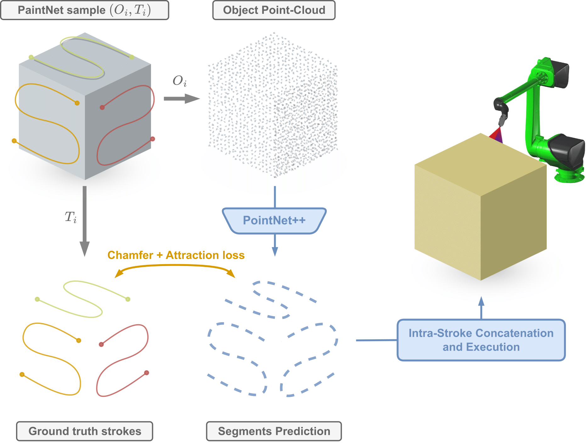

# PaintNet: Unstructured Multi-Path Learning from 3D Point Clouds for Robotic Spray Painting

[Preprint](https://arxiv.org/abs/2211.06930) / [Website](https://gabrieletiboni.github.io/paintnet/) / [Video](https://gabrieletiboni.github.io/paintnet/) / [Dataset](https://zenodo.org/records/10105273)

##### Gabriele Tiboni, Raffaello Camoriano, Tatiana Tommasi.

*Abstract:* Popular industrial robotic problems such as spray painting and welding require (i) conditioning on free-shape 3D objects and (ii) planning of multiple trajectories to solve the task. Yet, existing solutions make strong assumptions on the form of input surfaces and the nature of output paths, resulting in limited approaches unable to cope with real-data variability. By leveraging on recent advances in 3D deep learning, we introduce a novel framework capable of dealing with arbitrary 3D surfaces, and handling a variable number of unordered output paths (i.e. unstructured). Our approach focuses on predicting smaller path segments, which can be later concatenated to reconstruct long-horizon paths. We extensively validate the proposed method in the context of robotic spray painting by releasing PaintNet, the first public dataset of expert demonstrations on free-shape 3D objects collected in a real industrial scenario. A thorough experimental analysis demonstrates the capabilities of our model to promptly predict smooth output paths that cover up to 95% of the surface of previously unseen object instances. Furthermore, we show how models learned from PaintNet capture relevant features which serve as a reliable starting point to improve data and time efficiency when dealing with new object categories. [Watch video](https://gabrieletiboni.github.io/paintnet/)





Our release is **under construction**, you can track its progress below:

- [x] PaintNet dataset for public download
- [ ] Code implementation
	- [x] dataset loader
	- [x] training
	- [x] PCD evaluation metric
	- [ ] results rendering
	- [ ] intra-stroke concatenation
- [ ] Trained models


## Installation
This repo is not meant to be used as a python package. Just clone it, modify it and use it as you wish.
```
# Download PaintNet dataset from https://gabrieletiboni.github.io/paintnet/
# export PAINTNET_ROOT=<path/to/dataset/>

# git clone <this repo>
cd paintnet
pip install -r requirements.txt

cd torch-nndistance
python build.py install
```


## Getting Started
Run the `train.py` script to train a model and evaluate its performance on the test set by means of Pose-wise chamfer distance.

- *Training example (cuboids)*
	```
	python train.py --dataset cuboids-v1 \
			 --pc_points 5120 \
			 --traj_points 2000 \
			 --loss chamfer rich_attraction_chamfer \
			 --weight_rich_attraction_chamfer 0.5 \
			 --lambda_points 4 \
			 --extra_data orientnorm \
			 --weight_orient 0.25 \
			 --epochs 1250 \
			 --batch_size 32 \
			 --backbone pointnet2 --pretrained \
			 --seed 42
	```
- *Reproduce paper results* 
    - `python train.py --config cuboids_stable_v1.json --seed 42`
    - `python train.py --config cuboids_lambda1_v1.json --seed 42`
    - `python train.py --config windows_stable_v1.json --seed 42`
    - `python train.py --config shelves_stable_v1.json --seed 42`
    - `python train.py --config containers_stable_v1.json --seed 42`


## Citing
If you use this repository, please consider citing
```
@misc{tiboni2023paintnet,
	title={PaintNet: Unstructured Multi-Path Learning from 3D Point Clouds for Robotic Spray Painting}, 
	author={Gabriele Tiboni and Raffaello Camoriano and Tatiana Tommasi},
	year={2023},
	eprint={2211.06930},
	archivePrefix={arXiv},
	primaryClass={cs.RO}
}
```
